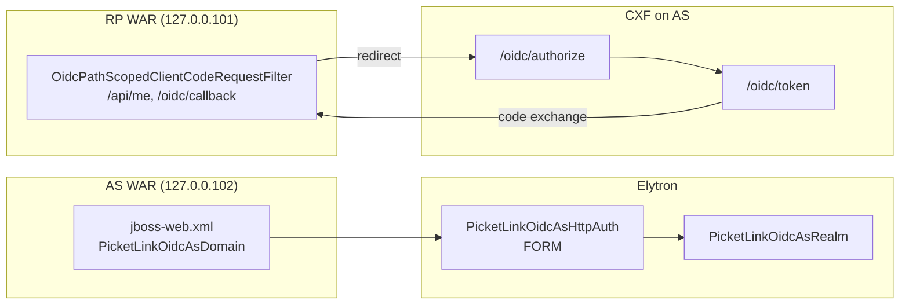

# OpenID Connect on WildFly 36 — Two-Server Setup Guide

This document describes how to run an **OpenID Connect Authorization Server (AS)** and **Relying Party (RP)** on separate WildFly 36 instances on a single workstation, using distinct loopback addresses and default HTTP ports. The approach mirrors the reference implementation in `picketlink-bindings/picketlink-wildfly-common/wildfly-36-oidc-demo` and applies equally when you deploy **your own application WAR** instead of the bundled Angular demo.

Unlike the SAML demo, OIDC does **not** require the PicketLink WildFly Elytron module (`org.picketlink`). Protocol handling is provided by **Apache CXF** and the `picketlink-oidc` library, packaged inside the demo WARs.

---

## 1. Architecture overview

Each OIDC role runs in its own JVM. The AS issues tokens and hosts the login form; the RP consumes tokens via the authorization-code flow.

| Role | Bind address | HTTP | Context path | Example base URL |
|------|--------------|------|--------------|------------------|
| **Relying Party (RP)** | `127.0.0.101` | `8080` | `/demo-rp` | `http://127.0.0.101:8080/demo-rp/` |
| **Authorization Server (AS)** | `127.0.0.102` | `8080` | `/demo-as` | `http://127.0.0.102:8080/demo-as/` |

Management interfaces use the same bind address on port **9990** (WildFly default, no port offset in the demo).

**Flow (authorization code):**

1. The user requests a protected resource on the RP (for example `GET /api/me` or navigates to `/app/secured`).
2. The CXF `OidcClientCodeRequestFilter` redirects the browser to the AS `/oidc/authorize` endpoint.
3. Elytron FORM authentication on the AS WAR requires login (`user1` / `password1` in the demo).
4. The AS issues an authorization code; the RP exchanges it at `/oidc/token`, validates the ID token against JWKS, and establishes a session.
5. The callback servlet redirects the browser to `/app/secured`.

Your application code does not implement OIDC directly. The AS protects `/oidc/authorize` via `web.xml` and Elytron; the RP protects selected JAX-RS paths via a CXF request filter registered at servlet startup.

---

## 2. Why use `127.0.0.101` and `127.0.0.102`?

OIDC redirect URIs, issuer URLs, and cookie scoping depend on **stable, distinct host names**. Running both AS and RP on `localhost` with the same port causes:

- Overlapping session cookies between deployments
- Mismatched `redirect_uri` and `issuer` values
- Redirect validation failures when each party must identify the other uniquely

Assigning each WildFly instance its own loopback IP address in the `127.0.0.0/8` subnet (`127.0.0.101` for the RP, `127.0.0.102` for the AS) while keeping the **default port 8080** gives you two logical hosts on one machine without DNS or TLS complexity.

### Configure loopback IP addresses (once per machine)

Linux:

```bash
sudo ip addr add 127.0.0.101/8 dev lo
sudo ip addr add 127.0.0.102/8 dev lo
```

Verify:

```bash
ip addr show lo | grep -E '127\.0\.0\.(101|102)'
```

These addresses persist until reboot unless you add them to your network configuration. Re-run the commands after a restart if needed.

---

## 3. Prerequisites

| Requirement | Notes |
|-------------|--------|
| **JDK 17+** | Matches PicketLink 2.5.x / WildFly 36 expectations |
| **Maven 3.8+** | Build PicketLink and package WARs |
| **WildFly 36** | Downloaded automatically by the demo IT module, or install manually |
| **PicketLink build** | `picketlink/modules/oidc` + WildFly OIDC demo WARs |
| **Loopback IPs** | As above |

Demo credentials (reference only):

- User: `user1`
- Password: `password1`
- Role: `role1`
- OIDC client: `demo-rp-client` / `demo-rp-secret`

Test keystore (bundled with the demo): `jbid_test_keystore.jks`, alias `servercert`, store password `store123`, key password `test123`.

---

## 4. Build and run the reference demo

From the repository root, build PicketLink and the WildFly 36 OIDC demo:

```bash
cd picketlink-bindings
mvn -Pwildfly36-oidc-demo -pl picketlink-wildfly-common/wildfly-36-oidc-demo -am verify \
  -Dpicketlink.version=2.5.5.jdk17.1
```

This compiles the OIDC module, packages `demo-as.war` and `demo-rp.war`, downloads two WildFly 36 instances, configures Elytron on the AS, deploys both WARs, and runs integration tests.

### Keep servers running for manual testing

```bash
mvn -Pwildfly36-oidc-demo,demo-keep-alive -pl picketlink-wildfly-common/wildfly-36-oidc-demo -am verify \
  -Dpicketlink.version=2.5.5.jdk17.1 -Ddemo.keep.alive=true
```

Servers remain up for 30 minutes (configurable). The test output prints a dashboard with URLs.

### Smoke test

1. Open the RP secured area: [http://127.0.0.101:8080/demo-rp/app/secured](http://127.0.0.101:8080/demo-rp/app/secured)
2. Confirm redirect to the AS authorize endpoint; log in with `user1` / `password1`
3. Confirm return to the RP with an authenticated session
4. Inspect discovery and endpoints:
   - Discovery: [http://127.0.0.102:8080/demo-as/.well-known/openid-configuration](http://127.0.0.102:8080/demo-as/.well-known/openid-configuration)
   - JWKS: [http://127.0.0.102:8080/demo-as/oidc/jwks](http://127.0.0.102:8080/demo-as/oidc/jwks)
   - RP info: [http://127.0.0.101:8080/demo-rp/api/info](http://127.0.0.101:8080/demo-rp/api/info)

---

## 5. WildFly server layout

The integration test stages two independent server homes:

```
wildfly-36-oidc-demo/demo-it/target/
├── wildfly-as/    ← binds 127.0.0.102:8080 (Authorization Server)
└── wildfly-rp/    ← binds 127.0.0.101:8080 (Relying Party)
```

Each instance is started similarly to:

```bash
./bin/standalone.sh \
  -b 127.0.0.102 \
  -bmanagement 127.0.0.102 \
  -Dpicketlink.test.keystore.path=$JBOSS_HOME/standalone/configuration/jbid_test_keystore.jks
```

(Use `127.0.0.101` for the RP instance.)

The AS server additionally loads a Java agent for keystore signing (see section 6.2). The IT sets this via `JAVA_OPTS`:

```bash
export JAVA_OPTS="$JAVA_OPTS -javaagent:$JBOSS_HOME/../picketlink-oidc-keystore-agent.jar"
```

---

## 6. Server configuration

OIDC splits configuration between **WildFly Elytron** (AS login only) and **application-level CXF** (protocol endpoints and RP token handling). There is no PicketLink Elytron mechanism on the RP.

| Server | Elytron changes | Application (WAR) |
|--------|-----------------|-------------------|
| **AS** | FORM realm + application security domain | CXF authorization server, discovery, JWKS |
| **RP** | None (default `other` domain only) | CXF OIDC client filter on protected paths |

The reference IT applies Elytron configuration programmatically via `DemoOidcElytronConfigurator.configureAs()` — only on the AS instance.

### 6.1 Component overview (Authorization Server)

| Component | Resource name | Purpose |
|-----------|---------------|---------|
| Properties realm | `PicketLinkOidcAsRealm` | AS FORM login from `picketlink-users.properties` / `picketlink-roles.properties` |
| Role mapper | `PicketLinkOidcAsRoleMapper` | Grants `role1` to authenticated principals |
| Elytron security domain | `PicketLinkOidcAsElytronDomain` | Holds the properties realm |
| HTTP auth factory | `PicketLinkOidcAsHttpAuth` | `FORM` against `PicketLinkOidcAsRealm` |
| Undertow app security domain | `PicketLinkOidcAsDomain` | WARs with `<security-domain>PicketLinkOidcAsDomain</security-domain>` |

Undertow **application-security-domain** name must match `jboss-web.xml` in the AS WAR:

| WAR | `jboss-web.xml` `<security-domain>` | Authentication |
|-----|--------------------------------------|----------------|
| AS | `PicketLinkOidcAsDomain` | FORM (local users) |
| RP | *(none — uses default)* | CXF OIDC filter on `/api/me`, `/oidc/callback` |

### 6.2 Server home files (not in `standalone.xml`)

Place these files under `$JBOSS_HOME/standalone/configuration/` on **both** server homes. The IT writes them in `DemoOidcElytronConfigurator.prepareServerHome()`:

**`picketlink-users.properties`**

```properties
user1=password1
```

**`picketlink-roles.properties`**

```properties
user1=role1
```

**`jbid_test_keystore.jks`** — test signing keystore (bundled in the IT classpath). Start each server with:

```bash
-Dpicketlink.test.keystore.path=$JBOSS_HOME/standalone/configuration/jbid_test_keystore.jks
```

The IT also **removes the default HTTPS listener** from `standalone.xml` on both instances (plain HTTP only for local demo). On the AS, attach the keystore agent JAR via `JAVA_OPTS` as shown in section 5 so CXF can sign ID tokens.

The RP does **not** need `picketlink-sp.login.conf` or a JAAS login module — unlike the SAML demo.

### 6.3 Management API / CLI operations (Authorization Server only)

Connect to the AS (adjust bind address if needed):

```bash
$JBOSS_HOME/bin/jboss-cli.sh --connect --controller=127.0.0.102:9990
```

Run the following in order. Idempotent re-runs can `remove` each resource first (the IT does this automatically).

```bash
# 1. Properties realm (AS users)
/subsystem=elytron/properties-realm=PicketLinkOidcAsRealm:add( \
  users-properties={path=picketlink-users.properties,relative-to=jboss.server.config.dir,plain-text=true}, \
  groups-properties={path=picketlink-roles.properties,relative-to=jboss.server.config.dir})

# 2. Role mapper
/subsystem=elytron/constant-role-mapper=PicketLinkOidcAsRoleMapper:add(roles=[role1])

# 3. Elytron security domain
/subsystem=elytron/security-domain=PicketLinkOidcAsElytronDomain:add( \
  realms=[{realm=PicketLinkOidcAsRealm}], \
  default-realm=PicketLinkOidcAsRealm, \
  role-mapper=PicketLinkOidcAsRoleMapper, \
  permission-mapper=default-permission-mapper)

# 4. HTTP authentication factory — AS (FORM)
/subsystem=elytron/http-authentication-factory=PicketLinkOidcAsHttpAuth:add( \
  security-domain=PicketLinkOidcAsElytronDomain, \
  http-server-mechanism-factory=global, \
  mechanism-configurations=[{mechanism-name=FORM, \
    mechanism-realm-configurations=[{realm-name=PicketLinkOidcAsRealm}]}])

# 5. Undertow application security domain (WAR linkage)
/subsystem=undertow/application-security-domain=PicketLinkOidcAsDomain:add( \
  http-authentication-factory=PicketLinkOidcAsHttpAuth)
```

No Elytron CLI operations are required on the RP server. Protected resources are enforced by the CXF filter registered in `RpCxfServlet`.

The DMR address structure matches `DemoOidcElytronConfigurator`: Elytron resources live under `/subsystem=elytron/...`; Undertow application security domains under `/subsystem=undertow/application-security-domain=...`.

### 6.4 Resulting `standalone.xml` snippets (Authorization Server)

After the operations above, the PicketLink additions appear inside the existing Elytron and Undertow subsystems on the **AS** instance. Only the **added** elements are shown below (default WildFly resources such as `ApplicationDomain`, `global`, and `other` are omitted).

**`subsystem xmlns="urn:wildfly:elytron:..."` — security domains, realms, mappers**

```xml
<security-domains>
    <!-- ... ApplicationDomain, ManagementDomain ... -->
    <security-domain name="PicketLinkOidcAsElytronDomain"
                     default-realm="PicketLinkOidcAsRealm"
                     permission-mapper="default-permission-mapper"
                     role-mapper="PicketLinkOidcAsRoleMapper">
        <realm name="PicketLinkOidcAsRealm"/>
    </security-domain>
</security-domains>

<security-realms>
    <!-- ... ApplicationRealm, ManagementRealm ... -->
    <properties-realm name="PicketLinkOidcAsRealm">
        <users-properties path="picketlink-users.properties"
                          relative-to="jboss.server.config.dir"
                          plain-text="true"/>
        <groups-properties path="picketlink-roles.properties"
                           relative-to="jboss.server.config.dir"/>
    </properties-realm>
</security-realms>

<mappers>
    <!-- ... default-permission-mapper, groups-to-roles ... -->
    <constant-role-mapper name="PicketLinkOidcAsRoleMapper">
        <role name="role1"/>
    </constant-role-mapper>
</mappers>
```

**`subsystem xmlns="urn:wildfly:elytron:..."` — HTTP authentication**

```xml
<http>
    <!-- ... application-http-authentication, management-http-authentication ... -->
    <http-authentication-factory name="PicketLinkOidcAsHttpAuth"
                                 security-domain="PicketLinkOidcAsElytronDomain"
                                 http-server-mechanism-factory="global">
        <mechanism-configuration>
            <mechanism mechanism-name="FORM">
                <mechanism-realm realm-name="PicketLinkOidcAsRealm"/>
            </mechanism>
        </mechanism-configuration>
    </http-authentication-factory>
    <provider-http-server-mechanism-factory name="global"/>
</http>
```

**`subsystem xmlns="urn:jboss:domain:undertow:..."` — application security domains**

```xml
<application-security-domains>
    <application-security-domain name="other" security-domain="ApplicationDomain"/>
    <application-security-domain name="PicketLinkOidcAsDomain"
                                 http-authentication-factory="PicketLinkOidcAsHttpAuth"/>
</application-security-domains>
```

These fragments were captured from a post-IT `standalone.xml` under `demo-it/target/wildfly-as/standalone/configuration/standalone.xml`.

**Relying Party:** the RP `standalone.xml` retains only the default Undertow application security domain:

```xml
<application-security-domains>
    <application-security-domain name="other" security-domain="ApplicationDomain"/>
</application-security-domains>
```

### 6.5 Request flow (reference)



---

## 7. Deploying your own application

The reference demo bundles an Angular SPA and CXF `/api/me` endpoints. Your application can be any Jakarta EE WAR — JSF, REST, servlets, or a static SPA served from `/app/*` — provided the **security envelope** is configured correctly.

### 7.1 RP WAR — required artifacts

**`WEB-INF/jboss-web.xml`**

```xml
<context-root>/your-rp-context</context-root>
```

No `<security-domain>` is required on the RP. OIDC protection is applied in servlet startup code.

**`WEB-INF/web.xml` — context parameters**

```xml
<context-param>
    <param-name>demo.base.url</param-name>
    <param-value>http://127.0.0.101:8080/your-rp-context/</param-value>
</context-param>
<context-param>
    <param-name>demo.as.base.url</param-name>
    <param-value>http://127.0.0.102:8080/your-as-context/</param-value>
</context-param>
```

**CXF servlet — register OIDC client filter**

At startup, configure the relying party (see `RpCxfServlet`):

```java
OidcRelyingPartyBootstrap.RelyingPartySetup setup =
        OidcRelyingPartyBootstrap.createSetup(
                asBaseUrl + "oidc/authorize",
                asBaseUrl + "oidc/token",
                rpBaseUrl + "oidc/callback",   // redirect_uri registered at AS
                null,                          // completeUri — use redirectUri only
                "me",                          // startUri — path that triggers OIDC
                trimTrailingSlash(asBaseUrl),  // issuer (must match ID token iss)
                asBaseUrl + "oidc/jwks");      // JWKS for ID token validation

OidcPathScopedClientCodeRequestFilter authFilter = setup.authFilter();
// Register authFilter + defaultProviders(authFilter) as JAX-RS providers
```

Key rules:

- **`redirect_uri`** must exactly match the URI registered at the AS (`demo.rp.redirect.uri` in the demo POM).
- **`issuer`** must match the `iss` claim in ID tokens (`setStripPathFromIssuerUri(false)` on the AS discovery service).
- Extend `OidcPathScopedClientCodeRequestFilter.requiresOidcFilter()` (or register the filter globally) to protect additional JAX-RS paths beyond `me` and `callback`.

**Callback resource**

After token exchange, redirect the user to your secured UI (demo uses `OidcCallbackResource` → `../app/secured`).

**Logout servlet**

Register a servlet mapped to `/LogoutServlet` (see `DemoOidcRpLogoutServlet`). Store the token context manager and AS end-session URL in servlet context attributes at startup.

### 7.2 AS WAR — required artifacts

**`WEB-INF/jboss-web.xml`**

```xml
<context-root>/your-as-context</context-root>
<security-domain>PicketLinkOidcAsDomain</security-domain>
```

The `security-domain` name must match the Undertow application-security-domain configured on that WildFly instance (section 6.3).

**`WEB-INF/web.xml` — protect authorize, expose public OIDC endpoints**

```xml
<!-- Public: discovery, token, jwks, userinfo, login form -->
<security-constraint>
    <web-resource-collection>
        <url-pattern>/.well-known/*</url-pattern>
        <url-pattern>/oidc/token</url-pattern>
        <url-pattern>/oidc/jwks</url-pattern>
        <url-pattern>/oidc/userinfo</url-pattern>
        <url-pattern>/FormLoginServlet</url-pattern>
        <url-pattern>/idp/logout</url-pattern>
        <url-pattern>/app/*</url-pattern>
    </web-resource-collection>
</security-constraint>

<!-- Requires login -->
<security-constraint>
    <web-resource-collection>
        <url-pattern>/oidc/authorize</url-pattern>
    </web-resource-collection>
    <auth-constraint>
        <role-name>role1</role-name>
    </auth-constraint>
</security-constraint>

<login-config>
    <auth-method>FORM</auth-method>
    <form-login-config>
        <form-login-page>/FormLoginServlet</form-login-page>
        <form-error-page>/FormLoginServlet</form-error-page>
    </form-login-config>
</login-config>
```

**CXF servlet — mount authorization server**

At startup (see `AsCxfServlet`):

```java
OidcKeystoreSupport.bootstrap(getBus(), Path.of(keystorePath));
OidcAuthorizationServerBootstrap.mount(getBus(), baseUrl, rpRedirectUri, serviceBeans);
```

Context parameters:

| Parameter | Example | Purpose |
|-----------|---------|---------|
| `demo.base.url` | `http://127.0.0.102:8080/demo-as/` | AS public base URL (issuer) |
| `demo.rp.base.url` | `http://127.0.0.101:8080/demo-rp/` | RP base URL (logout redirect) |
| `demo.rp.redirect.uri` | `http://127.0.0.101:8080/demo-rp/oidc/callback` | Registered redirect URI |

The AS registers these OIDC endpoints via CXF:

| Endpoint | Path |
|----------|------|
| Discovery | `/.well-known/openid-configuration` |
| Authorize | `/oidc/authorize` |
| Token | `/oidc/token` |
| JWKS | `/oidc/jwks` |
| UserInfo | `/oidc/userinfo` |
| End session | `/idp/logout` |

### 7.3 Client registration

The demo uses an in-memory OAuth client (`DemoOidcDataProvider`):

| Setting | Value |
|---------|-------|
| Client ID | `demo-rp-client` |
| Client secret | `demo-rp-secret` |
| Grant type | Authorization code |
| Redirect URI | `http://127.0.0.101:8080/demo-rp/oidc/callback` |
| Scopes | `openid`, `profile` |

When adapting for production, replace the in-memory provider with your client registry and align redirect URIs on both sides.

### 7.4 URL placeholders at build time

The demo WARs use Maven resource filtering for host and base URL tokens:

| Token | Default | Example filtered value |
|-------|---------|-------------------------|
| `@demo.rp.host@` | `127.0.0.101` | Loopback IP for RP |
| `@demo.as.host@` | `127.0.0.102` | Loopback IP for AS |
| `@demo.rp.base.url@` | `http://127.0.0.101:8080/demo-rp/` | RP public base URL |
| `@demo.as.base.url@` | `http://127.0.0.102:8080/demo-as/` | AS public base URL |
| `@demo.rp.redirect.uri@` | `http://127.0.0.101:8080/demo-rp/oidc/callback` | OIDC redirect URI |

Apply the same pattern in your Maven `pom.xml` so one build can target dev, staging, and production URLs without editing XML by hand.

---

## 8. Integrating a browser application (SPA or static UI)

The reference RP serves an Angular build under `/app/*` via a fallback servlet. Secured routes (for example `/app/secured`) rely on the SPA calling `GET /api/me` to detect session state.

Recommended pattern:

1. **Public shell** — `/app/`, static assets: no OIDC filter.
2. **Secured API** — `/api/me`: CXF filter triggers authorization-code flow when no token context exists.
3. **Callback** — `/oidc/callback`: completes the code exchange, then redirects to `/app/secured`.
4. **Client redirect** — if the SPA receives 401 or detects no session, navigate to a path that hits `/api/me` to start OIDC.

Avoid relying on client-side routes alone for security. Always enforce authentication on the server for APIs and sensitive paths.

---

## 9. Logout

| Type | URL | Behaviour |
|------|-----|-----------|
| **Local logout (LLO)** | `/LogoutServlet` or `/LogoutServlet?LLO=true` | Clears RP OIDC token context and HTTP session; AS session may remain |
| **Global logout (GLO)** | `/LogoutServlet?GLO=true` | RP clears session, then redirects to AS `/idp/logout` with `id_token_hint` and `post_logout_redirect_uri` |

In the demo, `/app/secured/logout?GLO=true` is mapped to `DemoOidcRpLogoutServlet` before the SPA fallback servlet runs. The AS end-session endpoint is implemented by `DemoOidcEndSessionServlet` at `/idp/logout`.

---

## 10. Customisation properties

Override defaults when running the IT or scripting your own launch:

```bash
-Ddemo.as.host=127.0.0.102 \
-Ddemo.rp.host=127.0.0.101 \
-Ddemo.http.port=8080 \
-Ddemo.mgmt.port=9990 \
-Ddemo.keep.alive.minutes=45
```

For production, replace loopback IPs with real DNS names, enable HTTPS on both endpoints, and use CA-issued signing keys in the keystore.

---

## 11. Troubleshooting

| Symptom | Likely cause |
|---------|----------------|
| Redirect loop after login | `redirect_uri` mismatch; check filtered WAR context params vs AS client registration |
| ID token validation failure | Issuer mismatch — AS `iss` must equal RP `IdTokenReader.setIssuerId()` base URL |
| `invalid_client` at token endpoint | Wrong client ID/secret in `OidcDemoConstants` vs AS data provider |
| Cookie/session confusion | Both servers on same host name; confirm loopback IPs and bind addresses |
| 403 on `/oidc/authorize` | Elytron not configured on AS; wrong `security-domain` in AS `jboss-web.xml` |
| `/api/me` returns 200 without login | OIDC filter not registered as JAX-RS provider, or path not in `requiresOidcFilter()` |
| Signing / JWKS errors | Keystore missing or agent not in `JAVA_OPTS`; verify `-Dpicketlink.test.keystore.path` |

Enable DEBUG on `org.picketlink`, `org.apache.cxf.rs.security.oidc`, and `org.wildfly.security` in `standalone/configuration/logging.properties` for detailed traces.

---

## 12. Reference module map

```
picketlink-bindings/picketlink-wildfly-common/wildfly-36-oidc-demo/
├── demo-oidc-shared/   Shared servlets, SPA fallback (RP), /api/me resource
├── demo-as-war/        Authorization Server WAR (CXF + Elytron FORM + VirtualResourcesServlet)
├── demo-rp-war/        Relying Party WAR (CXF OIDC client)
├── rp-ui/              Angular RP SPA (SpaFallbackServlet at /app/*)
└── demo-it/            Dual WildFly launcher, AS Elytron setup, tests

picketlink/modules/oidc/
├── oidc-admin-ui/      Angular 22 AS admin SPA (built into picketlink-oidc JAR)
├── OidcAuthorizationServerBootstrap.java
├── OidcRelyingPartyBootstrap.java
├── OidcPathScopedClientCodeRequestFilter.java
├── OidcKeystoreSupport.java
└── admin/
    ├── OidcKeyAdminResource.java      REST API for /api/keys and /api/keys/rotate
    └── OidcAdminUiSupport.java        Deployment constants for VirtualResourcesServlet

picketlink/modules/auth/
└── oauth/servlet/VirtualResourcesServlet.java   Serves oidc-admin-ui assets (opt-in via web.xml)
```

### AS admin UI (`oidc-admin-ui`)

| Item | Location |
|------|----------|
| Angular source | `picketlink/modules/oidc/oidc-admin-ui/` |
| Key admin REST API | `picketlink/modules/oidc/.../admin/OidcKeyAdminResource.java` (`GET /api/keys`, `POST /api/keys/rotate`) |
| Static asset servlet | `VirtualResourcesServlet` from `picketlink-auth`, mapped at `/app/*` in `demo-as-war/src/main/webapp/WEB-INF/web.xml` |
| Built assets | `META-INF/resources/oidc-admin-ui/` inside the `picketlink-oidc` JAR |

The admin UI is **disabled by default** unless `web.xml` sets servlet init-param `adminUiEnabled` to `true`. When disabled, requests to `/app/*` return **403 Permission denied** and the server logs a **WARN** with the parameter name. The reference demo WAR enables it explicitly.

Use this tree as the canonical example when wiring OIDC into your own WARs. The AS requires Elytron FORM login for `/oidc/authorize`; the RP relies on CXF filters rather than WildFly application security domains.

---

## 13. Production considerations

The loopback two-server layout is intended for **local development and integration testing**. Before production:

- Replace `127.0.0.x` with organisation DNS names (`auth.example.com`, `app.example.com`).
- Terminate TLS at each WildFly instance or a reverse proxy; register `https://` redirect URIs at the AS.
- Use dedicated signing keys per environment; rotate via your PKI process or the demo key-admin API (`POST /api/keys/rotate`).
- Externalise user stores (LDAP, database) instead of properties-file realms on the AS.
- Replace the in-memory OAuth client registry with a persistent store.
- Restrict management interfaces (`9990`) to administrative networks.

For project-specific support, refer to the PicketLink OIDC module and the `wildfly-36-oidc-demo` integration tests as living examples of a working AS/RP pair on WildFly 36.
