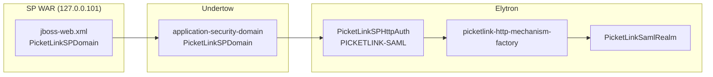

# SAML 2.0 on WildFly 36 — Two-Server Setup Guide

This document describes how to run a **SAML 2.0 Identity Provider (IDP)** and **Service Provider (SP)** on separate WildFly 36 instances on a single workstation, using distinct loopback addresses and default HTTP ports. The approach mirrors the reference implementation in `picketlink-bindings/picketlink-wildfly-common/wildfly-36-demo` and applies equally when you deploy **your own application WAR** instead of the bundled Angular demo.

---

## 1. Architecture overview

In a typical development or proof-of-concept layout, each SAML role runs in its own JVM. That separation reflects production topology (separate hosts or clusters) while remaining easy to operate locally.

| Role | Bind address | HTTP | Context path | Example base URL |
|------|--------------|------|--------------|------------------|
| **Service Provider (SP)** | `127.0.0.101` | `8080` | `/demo-sp` | `http://127.0.0.101:8080/demo-sp/` |
| **Identity Provider (IDP)** | `127.0.0.102` | `8080` | `/demo-idp` | `http://127.0.0.102:8080/demo-idp/` |

Management interfaces use the same bind address on port **9990** (WildFly default, no port offset in the demo).

**Flow (SP-initiated SSO):**

1. The user requests a protected resource on the SP (for example `/app/secured` or `/api/me`).
2. WildFly Elytron delegates to the PicketLink SAML mechanism; the browser is redirected to the IDP.
3. The user authenticates at the IDP (FORM login in the demo).
4. The IDP issues a SAML assertion; the SP validates it, establishes a security context, and serves the application.

Your application code does not implement SAML directly. Protection is declared in `web.xml` and `jboss-web.xml`; PicketLink bindings and Elytron perform the protocol exchange.

---

## 2. Why use `127.0.0.101` and `127.0.0.102`?

SAML metadata, redirect URLs, and cookie scoping depend on **stable, distinct host names**. Running both IDP and SP on `localhost` with the same port causes:

- Overlapping session cookies between deployments
- Ambiguous `EntityID` and `Audience` values in metadata
- Redirect validation failures when each party must identify the other uniquely

Assigning each WildFly instance its own loopback alias (`127.0.0.101` for the SP, `127.0.0.102` for the IDP) while keeping the **default port 8080** gives you two logical hosts on one machine without DNS or TLS complexity. This is a common pattern for local federation development.

### Configure loopback aliases (once per machine)

Linux:

```bash
sudo ip addr add 127.0.0.101/8 dev lo
sudo ip addr add 127.0.0.102/8 dev lo
```

Verify:

```bash
ip addr show lo | grep -E '127\.0\.0\.(101|102)'
```

These addresses persist until reboot unless you add them to your network configuration. Re-run the commands after a restart if needed.

---

## 3. Prerequisites

| Requirement | Notes |
|-------------|--------|
| **JDK 17+** | Matches PicketLink 2.5.x / WildFly 36 expectations |
| **Maven 3.8+** | Build PicketLink and package WARs |
| **WildFly 36** | Downloaded automatically by the demo IT module, or install manually |
| **PicketLink build** | Federation core + WildFly Elytron bindings (`picketlink-bindings`) |
| **Loopback aliases** | As above |

Demo credentials (reference only):

- User: `user1`
- Password: `password1`
- Role: `role1`

Test keystore (bundled with the demo): `jbid_test_keystore.jks`, alias `servercert`, store password `store123`, key password `test123`.

---

## 4. Build and run the reference demo

From the repository root, build PicketLink and the WildFly 36 SAML demo:

```bash
cd picketlink-bindings
mvn -Pwildfly36-demo -pl picketlink-wildfly-common/wildfly-36-demo -am verify \
  -Dpicketlink.version=2.5.5.jdk17.1
```

This compiles federation modules, packages `demo-sp.war` and `demo-idp.war`, downloads two WildFly 36 instances, configures Elytron, deploys both WARs, and runs integration tests.

### Keep servers running for manual testing

```bash
mvn -Pwildfly36-demo,demo-keep-alive -pl picketlink-wildfly-common/wildfly-36-demo -am verify \
  -Dpicketlink.version=2.5.5.jdk17.1 -Ddemo.keep.alive=true
```

Servers remain up for 30 minutes (configurable). The test output prints a dashboard with URLs.

### Smoke test

1. Open the SP secured area: [http://127.0.0.101:8080/demo-sp/app/secured](http://127.0.0.101:8080/demo-sp/app/secured)
2. Confirm redirect to the IDP; log in with `user1` / `password1`
3. Confirm return to the SP with an authenticated session
4. Inspect metadata:
   - IDP: [http://127.0.0.102:8080/demo-idp/metadata](http://127.0.0.102:8080/demo-idp/metadata)
   - SP: [http://127.0.0.101:8080/demo-sp/metadata](http://127.0.0.101:8080/demo-sp/metadata)

---

## 5. WildFly server layout

The integration test stages two independent server homes:

```
wildfly-36-demo/demo-it/target/
├── wildfly-idp/    ← binds 127.0.0.102:8080
└── wildfly-sp/     ← binds 127.0.0.101:8080
```

Each instance is started similarly to:

```bash
./bin/standalone.sh \
  -b 127.0.0.102 \
  -bmanagement 127.0.0.102 \
  -Dpicketlink.test.keystore.path=$JBOSS_HOME/standalone/configuration/jbid_test_keystore.jks \
  -Djava.security.auth.login.config=$JBOSS_HOME/standalone/configuration/picketlink-sp.login.conf
```

(Use `127.0.0.101` for the SP instance.)

System properties supply the signing keystore path and JAAS login configuration used by the SP SAML login module.

---

## 6. Elytron configuration (server level)

SAML on WildFly 36 is integrated through **Elytron**, not legacy `security-domain` XML. The reference IT applies the configuration programmatically via the WildFly management API (`DemoElytronConfigurator` in `wildfly-36-demo/demo-it`). For manual installs, run the equivalent `jboss-cli.sh` commands below (or paste the resulting XML fragments into `standalone.xml`).

Install the **PicketLink WildFly module** (`org.picketlink`) before configuring Elytron or deploying SAML WARs. The demo IT handles this via `PicketLinkModuleInstaller`.

### 6.1 Component overview

| Component | Resource name | Purpose |
|-----------|---------------|---------|
| Properties realm | `PicketLinkTestRealm` | IDP FORM login from `picketlink-users.properties` / `picketlink-roles.properties` |
| Custom SAML realm | `PicketLinkSamlRealm` | `PicketLinkSamlSecurityRealm` — validates assertions and maps subjects |
| Realm mapper | `picketlink-saml-realm-mapper` | Routes SAML mechanism to the custom realm |
| Role mapper | `PicketLinkTestRoleMapper` | Grants `role1` to authenticated principals |
| Mechanism factory | `picketlink-saml-mechanism-factory` | Service-loader factory from module `org.picketlink` |
| Aggregate factory | `picketlink-http-mechanism-factory` | Combines PicketLink SAML factory with Elytron `global` |
| Elytron security domain | `PicketLinkTestElytronDomain` | Holds both realms; default realm is the properties realm |
| HTTP auth factory (IDP) | `PicketLinkTestHttpAuth` | `FORM` against `PicketLinkTestRealm` |
| HTTP auth factory (SP) | `PicketLinkSPHttpAuth` | `PICKETLINK-SAML` against `PicketLinkSamlRealm` |
| Undertow app security domain (IDP) | `PicketLinkTestDomain` | WARs with `<security-domain>PicketLinkTestDomain</security-domain>` |
| Undertow app security domain (SP) | `PicketLinkSPDomain` | WARs with `<security-domain>PicketLinkSPDomain</security-domain>` |

Undertow **application-security-domain** names must match `jboss-web.xml` in each WAR:

| WAR | `jboss-web.xml` `<security-domain>` | Authentication |
|-----|--------------------------------------|----------------|
| IDP | `PicketLinkTestDomain` | FORM (local users) |
| SP | `PicketLinkSPDomain` | `PICKETLINK-SAML` |

**Both WildFly instances receive the same Elytron configuration.** Each server home defines both application security domains; only the deployed WAR selects which one is used (`PicketLinkTestDomain` on the IDP host, `PicketLinkSPDomain` on the SP host).

### 6.2 Server home files (not in `standalone.xml`)

Before Elytron configuration, place these files under `$JBOSS_HOME/standalone/configuration/` on **each** server (IDP and SP). The IT writes them in `DemoElytronConfigurator.prepareServerHome()`:

**`picketlink-users.properties`**

```properties
user1=password1
```

**`picketlink-roles.properties`**

```properties
user1=role1
```

**`picketlink-sp.login.conf`** (JAAS stack for the SP SAML login module)

```
PicketLinkSP {
    org.picketlink.identity.federation.bindings.wildfly.SAML2LoginModule required;
};
```

**`jbid_test_keystore.jks`** — test signing keystore (bundled in the IT classpath). Start each server with:

```bash
-Dpicketlink.test.keystore.path=$JBOSS_HOME/standalone/configuration/jbid_test_keystore.jks
-Djava.security.auth.login.config=$JBOSS_HOME/standalone/configuration/picketlink-sp.login.conf
```

### 6.3 Management API / CLI operations

Connect to the running server (adjust bind address per instance):

```bash
$JBOSS_HOME/bin/jboss-cli.sh --connect --controller=127.0.0.101:9990
```

Run the following in order. Idempotent re-runs can `remove` each resource first (the IT does this automatically).

```bash
# 1. Properties realm (IDP users)
/subsystem=elytron/properties-realm=PicketLinkTestRealm:add( \
  users-properties={path=picketlink-users.properties,relative-to=jboss.server.config.dir,plain-text=true}, \
  groups-properties={path=picketlink-roles.properties,relative-to=jboss.server.config.dir})

# 2. Custom SAML realm
/subsystem=elytron/custom-realm=PicketLinkSamlRealm:add( \
  class-name=org.picketlink.identity.federation.bindings.wildfly.elytron.PicketLinkSamlSecurityRealm, \
  module=org.picketlink)

# 3. Realm mapper (SAML mechanism → SAML realm)
/subsystem=elytron/constant-realm-mapper=picketlink-saml-realm-mapper:add(realm-name=PicketLinkSamlRealm)

# 4. Role mapper
/subsystem=elytron/constant-role-mapper=PicketLinkTestRoleMapper:add(roles=[role1])

# 5. PicketLink HTTP mechanism factory (service loader from org.picketlink module)
/subsystem=elytron/service-loader-http-server-mechanism-factory=picketlink-saml-mechanism-factory:add( \
  module=org.picketlink)

# 6. Aggregate factory (PicketLink + global Elytron mechanisms)
/subsystem=elytron/aggregate-http-server-mechanism-factory=picketlink-http-mechanism-factory:add( \
  http-server-mechanism-factories=[picketlink-saml-mechanism-factory,global])

# 7. Elytron security domain (both realms)
/subsystem=elytron/security-domain=PicketLinkTestElytronDomain:add( \
  realms=[{realm=PicketLinkTestRealm},{realm=PicketLinkSamlRealm}], \
  default-realm=PicketLinkTestRealm, \
  role-mapper=PicketLinkTestRoleMapper, \
  permission-mapper=default-permission-mapper)

# 8. HTTP authentication factory — IDP (FORM)
/subsystem=elytron/http-authentication-factory=PicketLinkTestHttpAuth:add( \
  security-domain=PicketLinkTestElytronDomain, \
  http-server-mechanism-factory=global, \
  mechanism-configurations=[{mechanism-name=FORM, \
    mechanism-realm-configurations=[{realm-name=PicketLinkTestRealm}]}])

# 9. HTTP authentication factory — SP (PICKETLINK-SAML)
/subsystem=elytron/http-authentication-factory=PicketLinkSPHttpAuth:add( \
  security-domain=PicketLinkTestElytronDomain, \
  http-server-mechanism-factory=picketlink-http-mechanism-factory, \
  mechanism-configurations=[{mechanism-name=PICKETLINK-SAML, \
    mechanism-realm-configurations=[{realm-name=PicketLinkSamlRealm, \
      realm-mapper=picketlink-saml-realm-mapper}]}])

# 10. Undertow application security domains (WAR linkage)
/subsystem=undertow/application-security-domain=PicketLinkTestDomain:add( \
  http-authentication-factory=PicketLinkTestHttpAuth)
/subsystem=undertow/application-security-domain=PicketLinkSPDomain:add( \
  http-authentication-factory=PicketLinkSPHttpAuth)
```

The DMR address structure matches `DemoElytronConfigurator`: Elytron resources live under `/subsystem=elytron/...`; Undertow application security domains under `/subsystem=undertow/application-security-domain=...`.

### 6.4 Resulting `standalone.xml` snippets

After the operations above, the PicketLink additions appear inside the existing Elytron and Undertow subsystems. Only the **added** elements are shown below (default WildFly resources such as `ApplicationDomain`, `global`, and `other` are omitted).

**`subsystem xmlns="urn:wildfly:elytron:..."` — security domains, realms, mappers**

```xml
<security-domains>
    <!-- ... ApplicationDomain, ManagementDomain ... -->
    <security-domain name="PicketLinkTestElytronDomain"
                     default-realm="PicketLinkTestRealm"
                     permission-mapper="default-permission-mapper"
                     role-mapper="PicketLinkTestRoleMapper">
        <realm name="PicketLinkTestRealm"/>
        <realm name="PicketLinkSamlRealm"/>
    </security-domain>
</security-domains>

<security-realms>
    <custom-realm name="PicketLinkSamlRealm"
                  module="org.picketlink"
                  class-name="org.picketlink.identity.federation.bindings.wildfly.elytron.PicketLinkSamlSecurityRealm"/>
    <!-- ... ApplicationRealm, ManagementRealm ... -->
    <properties-realm name="PicketLinkTestRealm">
        <users-properties path="picketlink-users.properties"
                          relative-to="jboss.server.config.dir"
                          plain-text="true"/>
        <groups-properties path="picketlink-roles.properties"
                           relative-to="jboss.server.config.dir"/>
    </properties-realm>
</security-realms>

<mappers>
    <!-- ... default-permission-mapper, groups-to-roles ... -->
    <constant-realm-mapper name="picketlink-saml-realm-mapper"
                           realm-name="PicketLinkSamlRealm"/>
    <constant-role-mapper name="PicketLinkTestRoleMapper">
        <role name="role1"/>
    </constant-role-mapper>
</mappers>
```

**`subsystem xmlns="urn:wildfly:elytron:..."` — HTTP authentication and mechanism factories**

```xml
<http>
    <!-- ... application-http-authentication, management-http-authentication ... -->
    <http-authentication-factory name="PicketLinkTestHttpAuth"
                                 security-domain="PicketLinkTestElytronDomain"
                                 http-server-mechanism-factory="global">
        <mechanism-configuration>
            <mechanism mechanism-name="FORM">
                <mechanism-realm realm-name="PicketLinkTestRealm"/>
            </mechanism>
        </mechanism-configuration>
    </http-authentication-factory>
    <http-authentication-factory name="PicketLinkSPHttpAuth"
                                 security-domain="PicketLinkTestElytronDomain"
                                 http-server-mechanism-factory="picketlink-http-mechanism-factory">
        <mechanism-configuration>
            <mechanism mechanism-name="PICKETLINK-SAML">
                <mechanism-realm realm-name="PicketLinkSamlRealm"
                                 realm-mapper="picketlink-saml-realm-mapper"/>
            </mechanism>
        </mechanism-configuration>
    </http-authentication-factory>
    <aggregate-http-server-mechanism-factory name="picketlink-http-mechanism-factory">
        <http-server-mechanism-factory name="picketlink-saml-mechanism-factory"/>
        <http-server-mechanism-factory name="global"/>
    </aggregate-http-server-mechanism-factory>
    <service-loader-http-server-mechanism-factory name="picketlink-saml-mechanism-factory"
                                                  module="org.picketlink"/>
    <!-- provider-http-server-mechanism-factory name="global" already present -->
</http>
```

**`subsystem xmlns="urn:jboss:domain:undertow:..."` — application security domains**

```xml
<application-security-domains>
    <application-security-domain name="other" security-domain="ApplicationDomain"/>
    <application-security-domain name="PicketLinkTestDomain"
                                 http-authentication-factory="PicketLinkTestHttpAuth"/>
    <application-security-domain name="PicketLinkSPDomain"
                                 http-authentication-factory="PicketLinkSPHttpAuth"/>
</application-security-domains>
```

These fragments were captured from a post-IT `standalone.xml` under `demo-it/target/wildfly-sp/standalone/configuration/standalone.xml` (the IDP server home contains the same PicketLink Elytron and Undertow entries).

### 6.5 Request flow (reference)



On the IDP host, the chain is the same shape but terminates at `PicketLinkTestHttpAuth` → `FORM` → `PicketLinkTestRealm` (properties file users).

---

## 7. Deploying your own application

The reference demo bundles an Angular SPA and a CXF `/api/me` endpoint. Your application can be any Jakarta EE WAR — JSF, REST, servlets, or a static SPA served from `/app/*` — provided the **security envelope** is configured correctly.

### 7.1 SP WAR — required artifacts

**`WEB-INF/jboss-web.xml`**

```xml
<context-root>/your-sp-context</context-root>
<security-domain>PicketLinkSPDomain</security-domain>
```

The `security-domain` name must match the Undertow application-security-domain configured on that WildFly instance.

**`WEB-INF/jboss-deployment-structure.xml`**

Declare a dependency on the PicketLink module and exclude the webservices subsystem (avoids classloading conflicts):

```xml
<dependencies>
    <module name="org.picketlink" services="export"/>
</dependencies>
<exclude-subsystems>
    <subsystem name="webservices"/>
</exclude-subsystems>
```

**`WEB-INF/web.xml` — protect your resources**

```xml
<security-constraint>
    <web-resource-collection>
        <web-resource-name>Protected application</web-resource-name>
        <url-pattern>/app/secured/*</url-pattern>
        <url-pattern>/api/me</url-pattern>
        <!-- add your API paths, servlets, etc. -->
    </web-resource-collection>
    <auth-constraint>
        <role-name>your-app-role</role-name>
    </auth-constraint>
</security-constraint>

<login-config>
    <auth-method>PICKETLINK-SAML</auth-method>
    <form-login-config>
        <form-login-page>/FormLoginServlet</form-login-page>
        <form-error-page>/error.html</form-error-page>
    </form-login-config>
</login-config>

<security-role>
    <role-name>your-app-role</role-name>
</security-role>
```

Only URL patterns listed in `<security-constraint>` trigger SAML. Public static assets, health checks, and metadata endpoints should remain unconstrained.

**`WEB-INF/picketlink.xml` — SP federation settings**

Key elements (replace placeholders with your URLs):

```xml
<PicketLinkSP BindingType="REDIRECT" LogOutPage="/logout.html">
    <IdentityURL>http://127.0.0.102:8080/demo-idp/</IdentityURL>
    <ServiceURL>http://127.0.0.101:8080/your-sp-context/</ServiceURL>
    <IDPMetadataFile>/WEB-INF/idp-metadata.xml</IDPMetadataFile>
    <!-- KeyProvider, MetaDataProvider, MetadataPublishing -->
</PicketLinkSP>
```

Important rules:

- **`IdentityURL`** and **`ServiceURL`** must be absolute base URLs including context path and trailing slash, matching how browsers and metadata expose the deployment.
- **`EntityId`** in the SP metadata provider should equal **`ServiceURL`** (or your chosen SP entity ID).
- **`IDPMetadataFile`** points to a copy of the IDP metadata XML (or use a dynamic provider in advanced setups).
- **`ValidatingAlias`** entries must map each peer hostname to the certificate alias used to verify signatures.

**Metadata servlet (SP)**

Register `MetadataServletSP` mapped to `/metadata` with `configFile` pointing at `picketlink.xml`.

**Signing keystore**

Place `jbid_test_keystore.jks` (or your PKI key) in WildFly `standalone/configuration/` and reference it from `picketlink.xml` `KeyProvider`, or pass `-Dpicketlink.test.keystore.path=...` at server start.

### 7.2 IDP WAR — required artifacts

**`WEB-INF/jboss-web.xml`**

```xml
<context-root>/your-idp-context</context-root>
<security-domain>PicketLinkTestDomain</security-domain>
```

**`WEB-INF/metadata-config.xml` — IDP federation settings**

```xml
<PicketLinkIDP AttributeManager="org.picketlink.identity.federation.bindings.wildfly.idp.UndertowAttributeManager"
               RoleGenerator="your.company.RoleGenerator">
    <IdentityURL>http://127.0.0.102:8080/your-idp-context/</IdentityURL>
    <Trust>
        <Domains>127.0.0.102,127.0.0.101,localhost</Domains>
    </Trust>
    <!-- KeyProvider, MetaDataProvider, MetadataPublishing -->
</PicketLinkIDP>
```

The **`Trust/Domains`** list must include every host name that appears in peer metadata or redirect URLs.

**IDP entity descriptor**

Ship `WEB-INF/idp-entity-metadata.xml` (or generate via `FileBasedEntityMetadataProvider`) with `entityID` equal to `IdentityURL` and SSO/SLO endpoints under the IDP context.

**`WEB-INF/web.xml` — IDP login**

The IDP uses standard **FORM** authentication for local user login, plus a root servlet (or filter) that handles incoming SAML authentication requests:

```xml
<login-config>
    <auth-method>FORM</auth-method>
    <form-login-config>
        <form-login-page>/FormLoginServlet</form-login-page>
        <form-error-page>/FormLoginServlet</form-error-page>
    </form-login-config>
</login-config>
```

Expose `/metadata` via `MetadataServlet` and keep `/FormLoginServlet`, `/LogoutServlet`, and `/app/*` publicly reachable without an authenticated principal where appropriate.

### 7.3 Metadata exchange

Each party must trust the other's signing certificate and endpoint locations.

| Direction | File / endpoint |
|-----------|-----------------|
| SP → IDP | SP consumes `idp-metadata.xml` (or live `http://127.0.0.102:8080/demo-idp/metadata`) |
| IDP → SP | IDP trust domain list + optional SP metadata URL |

After changing host names, context roots, or certificates, regenerate or republish metadata on **both** sides. Mismatched `EntityID` values are the most common cause of federation failures in development.

### 7.4 URL placeholders at build time

The demo WARs use Maven resource filtering for host and base URL tokens:

| Token | Default | Example filtered value |
|-------|---------|-------------------------|
| `@demo.sp.host@` | `127.0.0.101` | Loopback alias for SP |
| `@demo.idp.host@` | `127.0.0.102` | Loopback alias for IDP |
| `@demo.sp.base.url@` | `http://127.0.0.101:8080/demo-sp/` | SP public base URL |
| `@demo.idp.base.url@` | `http://127.0.0.102:8080/demo-idp/` | IDP public base URL |

Apply the same pattern in your Maven `pom.xml` so one build can target dev, staging, and production URLs without editing XML by hand.

---

## 8. Integrating a browser application (SPA or static UI)

The reference SP serves an Angular build under `/app/*` via a fallback servlet. Secured routes (for example `/app/secured`) are protected at the **server** by `web.xml`; the SPA checks session state by calling a backend endpoint such as `GET /api/me`.

Recommended pattern:

1. **Public shell** — `/app/`, static assets: no security constraint.
2. **Secured API or pages** — `/api/me`, `/app/secured/*`: require role `role1` (or your role); triggers SAML when unauthenticated.
3. **Client redirect** — if `/api/me` returns 401, redirect the browser to a protected URL to start SSO (the demo uses `/api/me` itself, which Elytron redirects to the IDP).

Avoid relying on client-side routes alone for security. Always enforce authentication on the server for APIs and sensitive paths.

---

## 9. Logout

| Type | Parameter | Behaviour |
|------|-----------|-----------|
| **Local logout (LLO)** | `?LLO=true` | Ends SP session only; IDP session may remain |
| **Global logout (GLO)** | `?GLO=true` | SP initiates SAML single logout; IDP session ends |

In the demo, links such as `/app/secured/logout?GLO=true` are handled by PicketLink Elytron logout handling before the SPA fallback servlet runs. Configure `LogOutPage` in `picketlink.xml` (for example `/logout.html`).

---

## 10. Customisation properties

Override defaults when running the IT or scripting your own launch:

```bash
-Ddemo.idp.host=127.0.0.102 \
-Ddemo.sp.host=127.0.0.101 \
-Ddemo.http.port=8080 \
-Ddemo.mgmt.port=9990 \
-Ddemo.keep.alive.minutes=45
```

For production, replace loopback aliases with real DNS names, enable HTTPS on both endpoints, and use CA-issued certificates in metadata and keystores.

---

## 11. Troubleshooting

| Symptom | Likely cause |
|---------|----------------|
| Redirect loop or instant 403 | `ServiceURL` / `IdentityURL` mismatch; check trailing slashes and context root |
| `Audience` or signature validation error | SP and IDP metadata out of sync; wrong `ValidatingAlias` or keystore alias |
| Cookie/session confusion | Both servers on same host name; confirm loopback aliases and bind addresses |
| SAML mechanism not offered | Elytron not configured; `org.picketlink` module missing; wrong `security-domain` in `jboss-web.xml` |
| 404 on `/metadata` | Metadata servlet not mapped or `picketlink.xml` / `metadata-config.xml` missing |

Enable DEBUG on `org.picketlink` and `org.wildfly.security` packages in `standalone/configuration/logging.properties` for detailed federation traces.

---

## 12. Reference module map

```
picketlink-bindings/picketlink-wildfly-common/wildfly-36-demo/
├── demo-shared/       Shared servlets, role generator, SPA fallback
├── demo-sp-war/       SP WAR (picketlink.xml, web.xml, Angular build)
├── demo-idp-war/      IDP WAR (metadata-config.xml, entity metadata)
├── sp-ui/ / idp-ui/   Angular source (optional reference UI)
└── demo-it/           Dual WildFly launcher, Elytron setup, tests
```

Use this tree as the canonical example when wiring SAML into your own WARs. The same Elytron and PicketLink configuration principles apply whether the deployed application is the demo UI or your product codebase.

---

## 13. Production considerations

The loopback two-server layout is intended for **local development and integration testing**. Before production:

- Replace `127.0.0.x` with organisation DNS names (`idp.example.com`, `app.example.com`).
- Terminate TLS at each WildFly instance or a reverse proxy; align SAML bindings with `HTTPS` redirect or POST as required.
- Use dedicated signing keys per role; rotate via your PKI process.
- Externalise user stores (LDAP, database) instead of properties-file realms.
- Restrict management interfaces (`9990`) to administrative networks.

For project-specific support, refer to the PicketLink federation documentation and the `wildfly-36-demo` integration tests as living examples of a working SP/IDP pair on WildFly 36.
